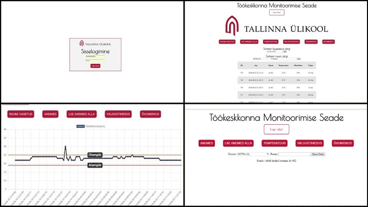

## Töökeskkonna Monitoorimise Seade

Link veebilehele: http://sisekliima.000webhostapp.com/login.php

### Eesmärk ja Lühikirjeldus
Projekti eesmärgiks oli luua töötav lahendus töökeskkonna monitoorimiseks. Seade tegeleb temperatuuri, niiskuse ja valgustiheduse mõõtmisega. Peale seda saadab andmed andmebaasi ning veebilehel kuvatakse näidud juba tabeli- ja graafikukujul. Graafikul on ka näha alampiire. Üle/alla mille näitavad peavad olema.
Projekt on loodud Digitehnoloogia Instituudi informaatika eriala esimese aasta Tarkvaraarenduse Praktika aine suvepraktika raames. 



### Tehnoloogiad
  * Alguses oli tihe koostöö Arduino IDE-ga(ver. 1.8.5), kus sai Arduino skeemile kirjutatud kood, mis hakkab tööle, kui seade tööle läheb.
  * Lõpuks oli vaja tekitada serveri pool, kuhu seade saaks andmeid saata.Selleks leidsime 000webhost-i, mis on tasuta serveri leht. Sealt saab faile ja ka serveri poolt hallata PHPMyAdmin-i kaudu

### Projekti panustajad
  * Katri Palo 
  * Dennis Richard Šulga 
  * Andre Martov 
  * Caspar Sepp 
  * Alexander Lawrence
### Seadme käivitamine ja kasutamine
 Tuleb laadida NODEMCU arendusplaadile vastav kood
-Luua andmebaas nimega sensor
-Tuleb omada serverit, kus veebilehte jooksutada 
-Luua vpconfig fail(kui ei ole olemas), kus määratakse ära server, andmebaasi nimi ja parool. Fail peab olema ühe astme võrra public_html kaustast väljas pool
-Oluline, et vpconfig fail on välja kutsutud(require) kõikides failides, kus suheldakse andmebaasiga
-Ülejäänud koodi osa paigutada public_html kausta
-Sisselogimiseks kasutada vastavat kasutajanime ja parooli

### Andmebaasi loomine
```
CREATE TABLE `sensor` (
  `id` int(11) NOT NULL,
  `time` datetime NOT NULL,
  `ruum` varchar(10) COLLATE utf8_unicode_ci NOT NULL,
  `temperatuur` float NOT NULL,
  `ohuniiskus` float NOT NULL,
  `valgus` int(11) NOT NULL
)
```
